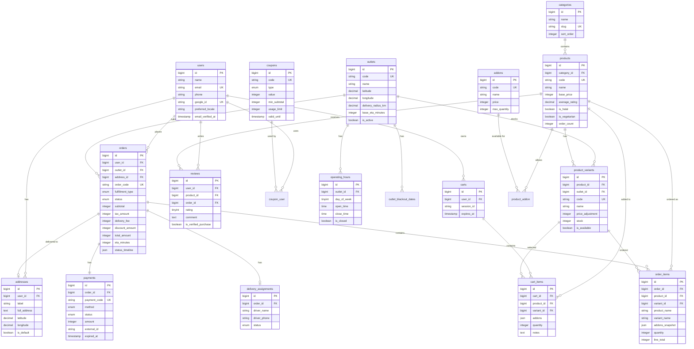
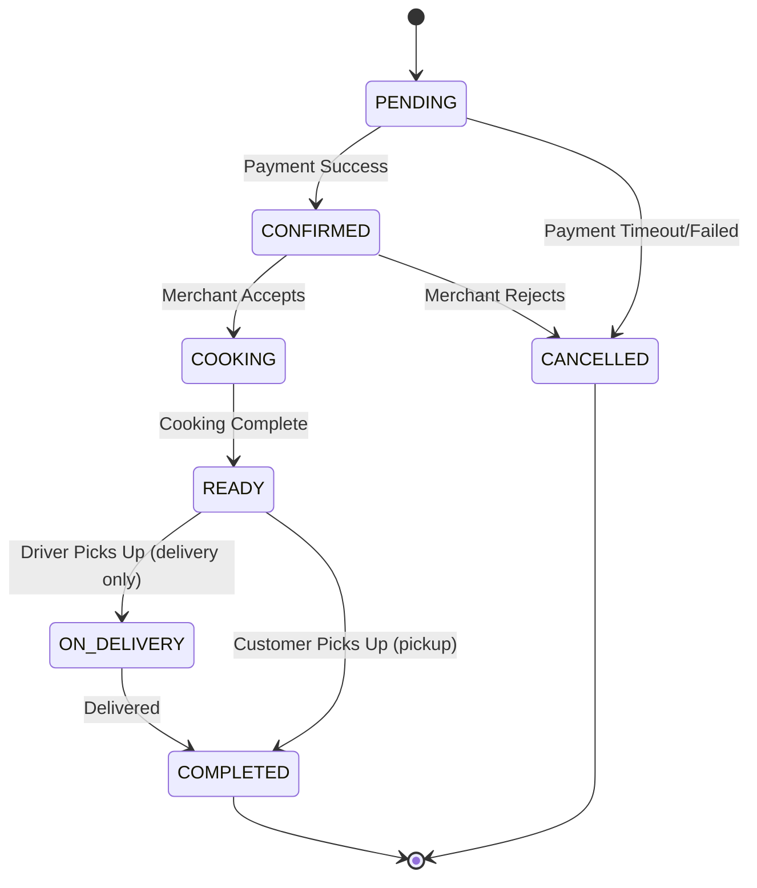
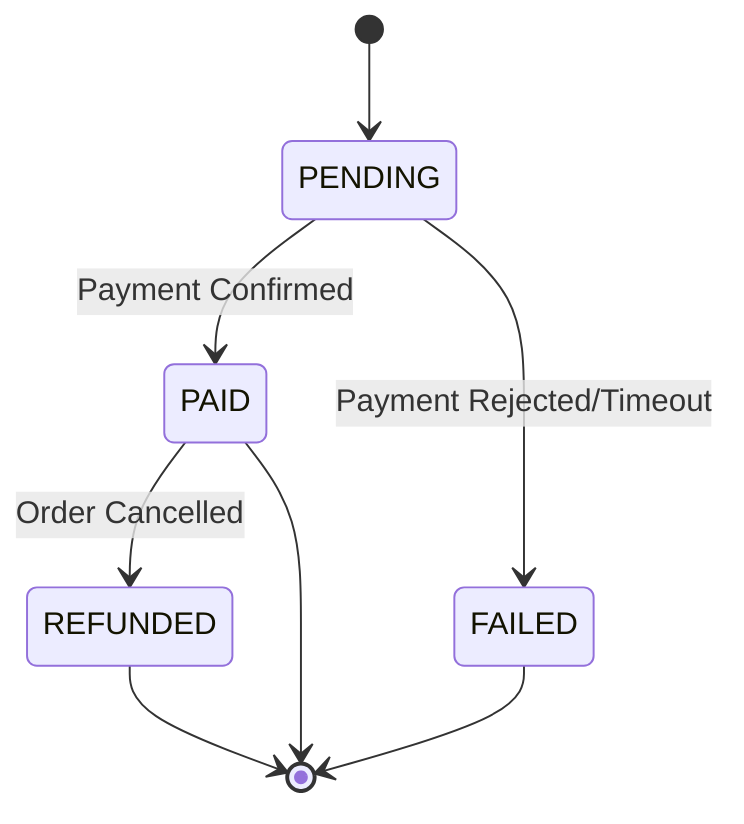

# ScanEatz - Database Schema & ERD

Dokumentasi lengkap skema database untuk ScanEatz Food Ordering Platform.

## Entity Relationship Diagram



## Table Descriptions

### Core User Management

#### `users`
- **Purpose**: Autentikasi dan profil customer
- **Features**: Email OTP, Google OAuth, multi-language support
- **Key Fields**: `email` (unique), `google_id` (unique), `preferred_locale`

#### `addresses`
- **Purpose**: Alamat pengiriman customer
- **Features**: Geolocation untuk delivery radius check
- **Key Fields**: `latitude`, `longitude`, `is_default`
- **Business Logic**: Setiap user bisa punya multiple alamat, 1 alamat default

### Outlet Management

#### `outlets`
- **Purpose**: Cabang/gerai Gajah Mada Food Street
- **Features**: Multi-branch support, delivery radius per outlet
- **Key Fields**: `code` (otl-1), `delivery_radius_km`, `base_eta_minutes`

#### `operating_hours`
- **Purpose**: Jam operasional per outlet per hari
- **Business Logic**: `day_of_week` (0=Minggu, 6=Sabtu)

#### `outlet_blackout_dates`
- **Purpose**: Hari libur/tanggal outlet tutup
- **Use Case**: Lebaran, Tahun Baru, renovasi, dll

### Catalog Management

#### `categories`
- **Purpose**: Kategori menu (Nasi, Mie, Ayam, Minuman, Dessert)
- **Features**: Sortable untuk display order

#### `products`
- **Purpose**: Master produk makanan/minuman
- **Features**: Rating, halal/vegetarian flag, popularity tracking
- **Key Fields**: `average_rating`, `order_count`, `is_halal`

#### `product_variants`
- **Purpose**: Varian produk (Level pedas, Porsi, dll)
- **Features**: Per-outlet stock management, price adjustment
- **Business Logic**: `final_price = base_price + price_adjustment`

#### `addons`
- **Purpose**: Topping/tambahan (Keju, Telur, Extra Sambal)
- **Features**: Max quantity limit

#### `product_addon` (pivot)
- **Purpose**: Many-to-many relationship products ↔ addons

### Shopping Cart

#### `carts`
- **Purpose**: Shopping cart (persisten)
- **Features**: Support guest (session_id) dan authenticated users
- **Expiration**: 7 hari untuk guest, unlimited untuk authenticated

#### `cart_items`
- **Purpose**: Items dalam cart
- **Features**: Price snapshot, addon tracking (JSON)
- **Key Fields**: `unit_price`, `addons_price` (snapshot saat add)

### Order Processing

#### `orders`
- **Purpose**: Pesanan customer
- **Features**: State machine status, pricing breakdown, ETA
- **Status Flow**: PENDING → CONFIRMED → COOKING → READY → ON_DELIVERY → COMPLETED
- **Key Fields**: `status_timeline` (JSON), `eta_minutes`
- **Critical Index**: `(outlet_id, status, created_at)` untuk dashboard

#### `order_items`
- **Purpose**: Line items dalam order
- **Features**: Immutable snapshot (nama, harga, addons saat order dibuat)
- **Why Snapshot**: Harga/nama produk bisa berubah setelah order

#### `payments`
- **Purpose**: Pembayaran order
- **Methods**: COD, Bank Transfer, E-Wallet, Credit Card
- **Features**: Payment gateway integration, expiration timeout
- **Key Fields**: `external_id` (dari payment gateway), `expired_at`

#### `delivery_assignments`
- **Purpose**: Assignment driver untuk delivery
- **MVP**: Manual entry, ready untuk integrasi 3rd party (Grab, GoSend)

### Promotions & Reviews

#### `coupons`
- **Purpose**: Kode promo/voucher
- **Types**: Percentage (%) atau Fixed (nominal rupiah)
- **Features**: Usage limit (global + per-user), validity period
- **Business Logic**: `max_discount` untuk type=percent

#### `coupon_user` (pivot)
- **Purpose**: Tracking penggunaan kupon per user

#### `reviews`
- **Purpose**: Rating & review produk
- **Features**: Verified purchase, moderation
- **Business Logic**: 1 review per product per order

## Indexes & Performance

### Critical Indexes

```sql
-- Dashboard outlet (most queried)
(outlet_id, status, created_at) on orders

-- Product filtering & sorting
(is_available, average_rating) on products
(category_id, is_available) on products

-- Geospatial queries
(latitude, longitude) on addresses
(latitude, longitude) on outlets

-- Cart lookup
(user_id) on carts
(session_id) on carts

-- User orders history
(user_id, created_at) on orders

-- Stock alerts
(stock) on product_variants
```

### Unique Constraints

- `users.email`
- `users.google_id`
- `outlets.code`
- `products.code`
- `product_variants.code`
- `orders.order_code`
- `payments.payment_code`
- `coupons.code`
- `(product_id, outlet_id, name)` on product_variants
- `(outlet_id, day_of_week)` on operating_hours

## State Machines

### Order Status State Machine



**Guards & Business Rules**:
- PENDING → CONFIRMED: Requires payment.status = PAID
- CONFIRMED → COOKING: Stock must be available, outlet must be open
- Cancel from CONFIRMED: Trigger stock release + refund
- Timeout: PENDING auto-cancels after 15 minutes if no payment

### Payment Status



## Business Logic & Calculations

### Pricing Calculation

```php
// Item price
$variantPrice = $product->base_price + $variant->price_adjustment;
$addonsPrice = array_sum($selectedAddons->pluck('price'));
$itemTotal = ($variantPrice + $addonsPrice) * $quantity;

// Order total
$subtotal = sum($cartItems->itemTotal);
$tax = $subtotal * TAX_RATE; // e.g., 10%
$deliveryFee = $deliveryService->calculateFee($outlet, $address);
$discount = $couponService->calculateDiscount($coupon, $subtotal);
$total = $subtotal + $tax + $deliveryFee - $discount;

// Pembulatan ke 100 rupiah terdekat
$total = round($total / 100) * 100;
```

### Delivery Fee Calculation

```php
$distance = haversineDistance($outlet->lat, $outlet->lng, $address->lat, $address->lng);

if ($distance > $outlet->delivery_radius_km) {
    throw new OutOfRangeException();
}

// Base fee + per km
$baseFee = 5000; // Rp 5.000
$perKm = 2000;   // Rp 2.000/km
$deliveryFee = $baseFee + ($distance * $perKm);
```

### ETA Calculation

```php
$basePrep = $outlet->base_eta_minutes; // 30 min
$cookingTime = max($items->pluck('preparation_time_minutes')); // 15 min
$deliveryTime = $distance * 3; // 3 min per km
$queueFactor = $activeOrders->count() * 2; // 2 min per order in queue

$eta = $basePrep + $cookingTime + $deliveryTime + $queueFactor;
```

### Stock Reservation Strategy

**Recommended**: Reserve stock saat order CONFIRMED (setelah payment)

**Trade-offs**:
- ✅ Prevents oversell
- ✅ No deadlock dari abandoned carts
- ✅ Fair (first paid, first served)
- ⚠️ Requires payment timeout mechanism (15 min)
- ⚠️ User bisa checkout tapi habis saat bayar (rare, handled by validation)

**Implementation**:
```php
// On order CONFIRMED
StockService::reserve($order);

// On order CANCELLED or payment timeout
StockService::release($order);

// On checkout (before payment)
StockService::validate($cartItems); // Soft check for UX
```

## Data Integrity Rules

1. **Cascading Deletes**:
   - Delete user → cascade delete addresses, carts, reviews
   - Delete outlet → cascade delete operating_hours, variants
   - Delete order → cascade delete order_items, payment

2. **Null on Delete**:
   - Delete address → order.address_id becomes null (preserve order history)
   - Delete variant → cart_item.variant_id becomes null

3. **Immutable After Creation**:
   - `order_items.*` (snapshot, cannot edit)
   - `orders.status_timeline` (append-only)

4. **Soft Validation** (app-level, not DB constraints):
   - Coupon validity (dates, usage limits)
   - Operating hours compliance
   - Delivery radius check

## Migration Order

Migrations dijalankan dalam urutan timestamp untuk menghormati foreign key dependencies:

1. `users` (root table)
2. `addresses` (FK: user_id)
3. `outlets` (independent)
4. `operating_hours`, `outlet_blackout_dates` (FK: outlet_id)
5. `categories` (independent)
6. `products` (FK: category_id)
7. `product_variants` (FK: product_id, outlet_id)
8. `addons`, `product_addon` (FK: product_id, addon_id)
9. `carts` (FK: user_id)
10. `cart_items` (FK: cart_id, product_id, variant_id)
11. `coupons`, `coupon_user` (FK: coupon_id, user_id)
12. `orders` (FK: user_id, outlet_id, address_id)
13. `order_items` (FK: order_id, product_id, variant_id)
14. `payments` (FK: order_id)
15. `delivery_assignments` (FK: order_id)
16. `reviews` (FK: user_id, product_id, order_id)

## Sample Queries

### Get Product with Variants & Addons
```sql
SELECT p.*, v.*, a.*
FROM products p
LEFT JOIN product_variants v ON p.id = v.product_id AND v.outlet_id = ?
LEFT JOIN product_addon pa ON p.id = pa.product_id
LEFT JOIN addons a ON pa.addon_id = a.id
WHERE p.id = ? AND p.is_available = 1;
```

### Get Orders by Outlet & Status
```sql
SELECT o.*, u.name as customer_name
FROM orders o
JOIN users u ON o.user_id = u.id
WHERE o.outlet_id = ? 
  AND o.status IN ('CONFIRMED', 'COOKING')
ORDER BY o.created_at ASC;
```

### Get Best Sellers (Last 30 Days)
```sql
SELECT p.*, SUM(oi.quantity) as total_sold
FROM products p
JOIN order_items oi ON p.id = oi.product_id
JOIN orders o ON oi.order_id = o.id
WHERE o.created_at >= DATE_SUB(NOW(), INTERVAL 30 DAY)
  AND o.status = 'COMPLETED'
GROUP BY p.id
ORDER BY total_sold DESC
LIMIT 10;
```

### Find Nearest Outlets
```sql
SELECT *,
  (6371 * acos(
    cos(radians(?)) * cos(radians(latitude)) * 
    cos(radians(longitude) - radians(?)) + 
    sin(radians(?)) * sin(radians(latitude))
  )) AS distance_km
FROM outlets
WHERE is_active = 1
HAVING distance_km <= delivery_radius_km
ORDER BY distance_km ASC;
```

## Next Steps

1. ✅ Migrations created
2. ⏭️ Create Eloquent Models with relationships
3. ⏭️ Create Factories for test data
4. ⏭️ Create Seeders with dummy data (10 products, 2 outlets)
5. ⏭️ Test migrations: `php artisan migrate`
